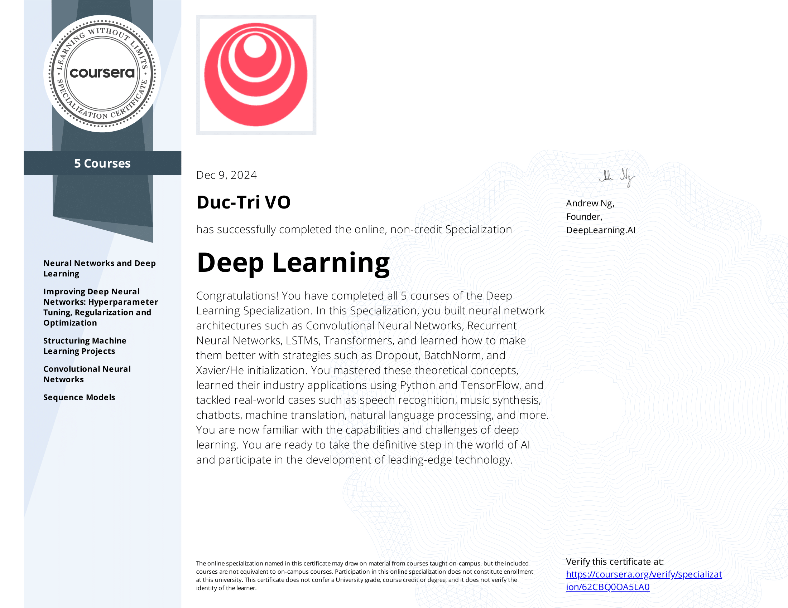

# Deep Learning Specialization
Approximately 3 months at 10 hours a week to complete!

Verify link: [Coursera.com](https://coursera.org/share/778cacf9bbb9bb7cc641f6c12d7a4f4e)

In this Specialization, the learner built neural network architectures such as Convolutional Neural Networks, Recurrent Neural Networks, LSTMs, Transformers, and learned how to improve them with strategies such as Dropout, BatchNorm, and Xavier/He initialization. The learner mastered these theoretical concepts, learned their industry applications using Python and TensorFlow, and tackled real-world cases such as speech recognition, music synthesis, chatbots, machine translation, natural language processing, and more. The learner is now familiar with the capabilities and challenges of deep learning and is ready to take the definitive step in the world of AI and participate in the development of leading-edge technology.

### Course List:
1. Neural Networks and Deep Learning  
2. Improving Deep Neural Networks: Hyperparameter Tuning, Regularization, and Optimization  
3. Structuring Machine Learning Projects  
4. Convolutional Neural Networks  
5. Sequence Models
